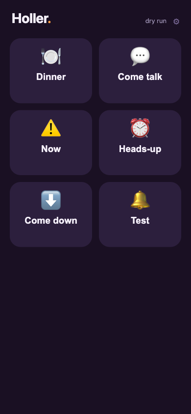
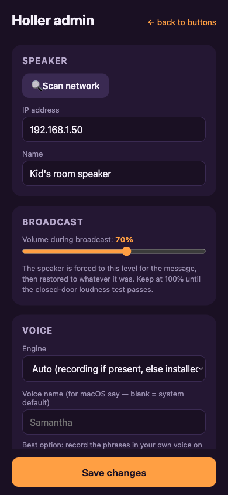
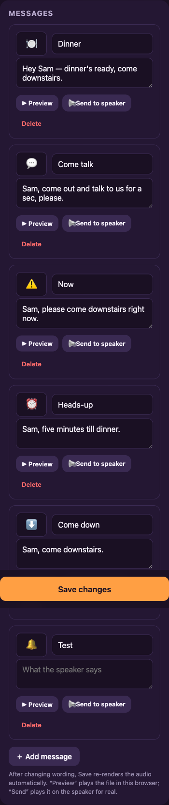

# Holler 📢

One tap on a parent's phone → attention chime + spoken message on the kid's
Google/Nest speaker, **forced loud**, interrupting whatever they're playing.
One-way by design. LAN-only. No cloud, no accounts, no data leaves the house.

| The app | Admin: speaker & volume | Admin: edit messages |
|---|---|---|
|  |  |  |

```
[Parent phone PWA] --HTTP--> [FastAPI (Docker)] --pychromecast--> [Google/Nest speaker]
                                  |
                                  +-- serves pre-rendered audio over LAN HTTP
                                  +-- presets.yaml (edited via /admin page)
```

Per tap: connect to the pinned speaker → stash its current volume → set the
broadcast volume → cast the pre-rendered file → wait for playback → restore the
stashed volume. Concurrent taps get "already playing" so two parents can't
stomp each other's volume capture/restore. Whatever the kid was playing does
**not** auto-resume — feature, not bug.

## Setup

### 1. Get it running

**Docker (recommended, e.g. on a home server):**

```bash
git clone https://github.com/dstahl11/holler.git && cd holler
cp presets.example.yaml presets.yaml
docker compose up -d --build
```

The compose file uses host networking so the speaker can fetch audio straight
from your server's LAN IP. App: `http://<server-ip>:8000`.

**Bare Python (dev / Mac):**

```bash
python3 -m venv .venv && .venv/bin/pip install -r requirements.txt
cp presets.example.yaml presets.yaml
.venv/bin/uvicorn app.main:app --host 0.0.0.0 --port 8000
```

Set `HOLLER_DRY_RUN=1` to simulate casts while you play with the UI.

### 2. Point it at your speaker

Open **`http://<server>:8000/admin`** (or the ⚙︎ gear in the app):

1. Tap **Scan network** — every Cast device in the house shows up.
2. Tap your kid's speaker. Done.

Give the speaker a **DHCP reservation** in your router so its IP never moves.
(CLI alternative: `python scripts/discover.py`, then edit `presets.yaml`.)

### 3. Make it say your kid's name

Still in `/admin`: edit the message text on each card (the examples say "Sam"),
then **Save changes** — audio re-renders automatically. TTS engines:

- **macOS `say`** — used automatically when running on a Mac.
- **Piper** (self-hosted neural TTS) — bundled in the Docker image, works out
  of the box.
- **Recorded parent voice** — the one kids actually respond to. Record each
  phrase on your phone, drop the files at `audio/raw/<preset-id>.m4a` (any
  format), Save/re-render. Recordings always win over TTS.

Every rendered file is chime + phrase baked into one normalized WAV, ~3–8s.

### 4. ⚠️ Run the loudness test

Tap the 🔔 **Test** button (chime only) with the kid's door closed and their
own audio playing. Max loudness varies a lot by model — a Nest Mini caps much
lower than a Nest Audio or full Home. If it doesn't cut through: cast to a
speaker group, move a bigger speaker into the room, or add one in the hallway.
Volume slider lives in `/admin` (field-tested: 100% on a full Google Home
produced a formal complaint from the target; 70% is plenty).

### 5. Install on the parents' phones

Open the app URL in Safari (iOS) or Chrome (Android) → **Share → Add to Home
Screen**. Opens full-screen with big buttons. That's the entire daily UX:
open, tap, done.

> Browsers only enable service workers over HTTPS, so over plain LAN HTTP this
> is a home-screen shortcut rather than a fully installed PWA — which is all it
> needs. Add Tailscale + HTTPS later and offline caching lights up by itself.

## Administration

Everything lives in **`/admin`** — scan/pick speaker, add/reword/delete
messages (Save re-renders audio), broadcast volume, and two independent PINs:

- **App PIN** — gates the button grid, if the kids discover the URL and start
  counter-broadcasting.
- **Admin PIN** — gates this settings page.

Changes hot-reload; no restart. Saves write `presets.yaml` (previous version
kept as `presets.yaml.bak`), so hand-editing the YAML still works too.

## API

- `GET /api/presets` — button list for the PWA
- `POST /api/broadcast/{id}` — do it (`X-Pin` header if PIN set). `200` sent,
  `401` bad PIN, `429` already playing, `502` speaker unreachable
- `GET /api/health` — is the speaker reachable
- `GET|PUT /api/admin/config`, `POST /api/admin/scan`, `POST /api/admin/render`
  — the admin page's API (`X-Admin-Pin` header if set)

## Config reference (`presets.yaml`)

| Key | Meaning |
|-----|---------|
| `device.host` | Speaker IP (pin it with a DHCP reservation) |
| `device.uuid` | Optional; captured automatically when you pick from a scan |
| `broadcast.volume` | 0.0–1.0 forced during broadcast |
| `broadcast.play_timeout` | Max seconds to wait before restoring volume |
| `broadcast.advertise_host` | LAN IP the speaker fetches audio from; auto-detected if empty |
| `security.pin` / `security.admin_pin` | App / admin PIN gates; `""` disables |
| `tts.engine` | `auto` / `say` / `piper` — `auto` prefers `audio/raw/` recordings |
| `presets[]` | `id`, `label`, `emoji`, `tts` (or `file:` for custom audio) |

## Design notes

- **Cast, not Google's native Broadcast** — native Broadcast plays at a fixed
  volume you can't override; casting lets us force loud. Loud won.
- **One-way on purpose** — the only "reply" path Google offers conflicts with
  forced volume, and we're optimizing for *impossible to ignore*.
- **Pre-rendered audio, not TTS at trigger time** — lower latency, predictable
  output, no runtime dependency.
- **LAN-only** — bind it to your home network and don't port-forward it. The
  attack surface is "people on your Wi-Fi," and there's a PIN for them.
